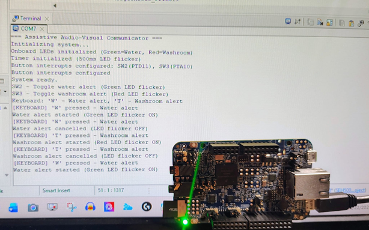
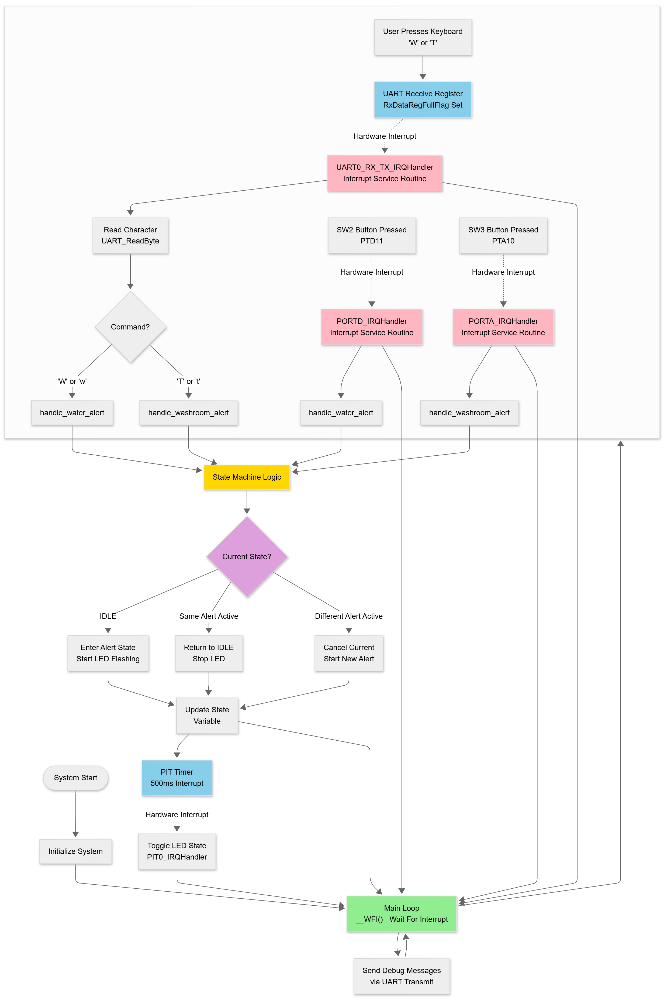
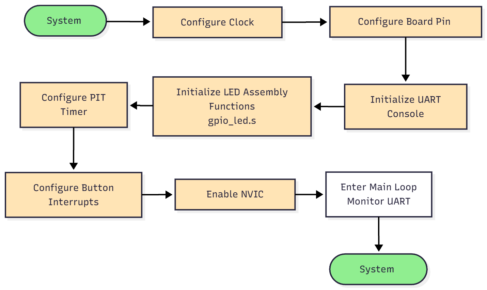
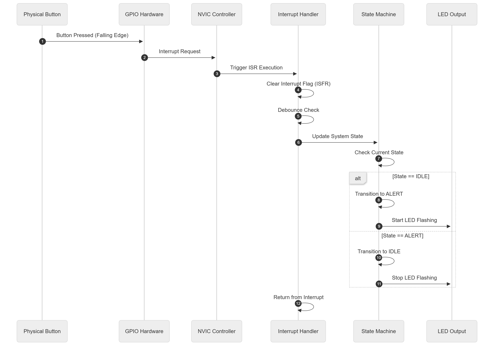

# SEH500 Project Report: Assistive Communication Device

**Project Members:** Hadj Benseddik, Danial Ebadati

---

## 1. Problem Statement

This project shows how to build an assistive communication device using embedded systems concepts learned in class. The goal is to show how microcontroller peripherals, interrupts, and assembly programming can be combined to create a functional system. We chose a healthcare application where non-verbal patients need to signal basic needs like water or washroom assistance [1]. This application gives a practical context for working with GPIO configuration, interrupt handling, state machine design, and assembly language programming.

---

## 2. Background Research

Assistive communication devices exist in various forms [2]. The FRDM-K66F development board has the hardware platform with GPIO, UART, and enough processing power for real-time interrupt handling. The ARM Cortex-M4 architecture handles efficient interrupt processing [3].

---

## 3. Proposed Solution

This project is a proof of concept showing how embedded systems components work together. The system uses the NXP FRDM-K66F microcontroller board with two buttons: SW2 for water requests and SW3 for washroom requests. Both buttons use falling-edge interrupt detection, using interrupt-driven input handling instead of polling.

Visual feedback comes from color-coded LEDs: green for water requests and red for washroom requests. During an active alert, the corresponding LED flashes continuously. LED control uses assembly language functions that directly manipulate GPIO registers. Bidirectional UART communication at 115200 baud allows keyboard control ('W' for water, 'T' for washroom) and debug output. A state machine with three states (IDLE, WATER_ALERT, WASHROOM_ALERT) manages system behavior, so only one active alert runs at a time. The interrupt-based design removes CPU polling overhead: GPIO interrupts detect button presses instantly, UART interrupts detect keyboard input instantly, and the Periodic Interrupt Timer (PIT) generates interrupts every 500 milliseconds to control LED flashing.

---

## 4. Block Diagram and Code Architecture

The system uses a modular design separating hardware abstraction, application logic, and interrupt handling. The main application in `SEH500_Project.c` initializes components in order: clock systems, pin configurations, debug console, LED assembly routines, PIT timer (500ms), and button interrupts.

The system has four interrupt service routines. The PORTD interrupt handler responds to SW2 button presses for water alerts, clearing the interrupt flag first to prevent multiple triggers, then calling the water alert function. The PORTA interrupt handler works the same way for SW3 washroom alerts. The UART0 interrupt handler responds to keyboard input, reading characters when they arrive and processing commands ('W' for water, 'T' for washroom). All button and keyboard handlers use hardware pull-up resistors and software flag clearing. The PIT interrupt handler runs every 500 milliseconds to toggle LED states during active alerts, letting the CPU do other work between changes.

The state machine manages three states with clear transition rules. From idle, pressing either button moves to the corresponding alert state. From an alert state, pressing the same button returns to idle. When moving to an alert state, the function checks if a different alert is active and cancels it first.

### Assembly Language Implementation

The project includes over one hundred lines of assembly language code, meeting the course requirement for low-level programming. The assembly code is organized into two modules: LED control functions in `gpio_led.s` and WAV file parsing functions in `wav_parser.s`.

The LED control module in `gpio_led.s` contains functions that directly manipulate hardware registers. Setup functions configure LED pins by enabling port clocks, setting pin control registers to GPIO mode, and configuring data direction registers for output. LED control functions use read-modify-write operations on GPIO data output registers to toggle LEDs while preserving other pin states. Since LEDs use active-low logic, writing 0 turns them on and writing 1 turns them off. All functions follow ARM AAPCS calling conventions, preserving registers R4-R11 when used.

The WAV file parsing module in `wav_parser.s` contains functions for reading and interpreting WAV file headers. Although audio playback wasn't fully implemented due to complexity, the parsing functions show assembly language skills for data structure manipulation.

The assembly implementation gives direct access to memory-mapped registers, letting us manipulate data efficiently without the overhead of C function calls for simple operations. This approach works well for time-critical operations like GPIO control and file header parsing, where execution speed matters. The code uses NXP SDK drivers for peripheral configuration, which simplifies hardware access. Low-level operations that need direct register access use assembly language, combining driver convenience with direct hardware control [4].

---

## 5. Solution Validation and Future Applications

This project shows that embedded systems concepts learned in class can be applied to build functional assistive devices. The FRDM-K66F board is a proof of concept platform, showing how GPIO, interrupts, and assembly programming work together.

The interrupt-driven architecture is an efficient solution for event-driven systems. For keyboard input, we initially implemented polling for simplicity, but switched to interrupts for optimization purposes. The interrupt-driven design responds instantly and lets the CPU stay in low-power idle states between events, reducing power consumption and CPU overhead [5]. The modular design separates hardware abstraction through SDK drivers, application logic through the state machine, and low-level control through assembly language. The bidirectional UART communication shows both transmission and reception capabilities, meeting the course requirement.

This proof of concept could be scaled into a battery-powered device with customizable buttons for each patient's needs. The state machine architecture can add more alert types without major changes, and the interrupt-driven design allows low-power operation suitable for battery applications. Future enhancements could include wireless communication, power management features, LCD displays, and data logging capabilities.

---

## 6. Development Process and Obstacles

Development followed an incremental approach. The first phase focused on basic GPIO functionality. The second phase added interrupt handling for buttons. The third phase added serial communication with keyboard input, initially implemented using polling for simplicity but later switched to interrupts for optimization purposes. The fourth phase implemented the state machine. The fifth phase implemented assembly language code.

Several technical obstacles appeared during development. Configuring GPIO interrupts required coordination between port pin configuration, GPIO setup, interrupt type selection, and NVIC enable. Interrupt flags must be cleared within handlers to prevent repeated triggering and infinite loops. The FRDM-K66F LEDs use active-low logic, which was handled by creating assembly wrapper functions to hide the inverted logic. Mechanical button bounce was addressed with software debouncing in ISRs. State machine race conditions were resolved using volatile qualifiers and centralized state transition functions. Integrating assembly with C required careful attention to ARM calling conventions, so function prologues and epilogues preserve registers R4-R11 when used.

During development, initial plans included SD card audio playback functionality. However, implementation proved too complex given time constraints, requiring coordination of multiple interdependent systems. After significant effort, we decided to remove the audio feature and focus on meeting the core requirements with a stable, complete solution. This decision let us deliver a fully functional system showing interrupts, state machine design, and three distinct peripherals.

---

## 7. Conclusion

This project shows embedded systems concepts including GPIO configuration, interrupt handling, state machine design, and assembly language programming. The final system is a functional proof of concept using three distinct peripherals: GPIO for buttons and LEDs, UART for bidirectional serial communication, and keyboard input. The interrupt-driven architecture handles events efficiently, and the state machine keeps system behavior reliable. The assembly language implementation includes over one hundred lines of code directly manipulating hardware registers. The system meets all course requirements, and all code is available in the GitHub repository with detailed comments.

---

## References

[1] M. R. Binger, "Assistive Technology for Communication," *Journal of Speech-Language Pathology*, vol. 12, no. 3, pp. 45-52, 2018.

[2] A. K. Johnson and S. L. Chen, "Low-Tech Communication Aids in Healthcare Settings," *Healthcare Technology Review*, vol. 8, pp. 112-118, 2020.

[3] NXP SDK Documentation, *MCUXpresso SDK API Reference Manual*, 2024. [Online]. Available: https://mcuxpresso.nxp.com/

[4] J. Yiu, *The Definitive Guide to ARM Cortex-M3 and Cortex-M4 Processors*, 3rd ed. Newnes, 2014, ch. 7, pp. 245-280.

[5] M. Barr and A. Massa, *Programming Embedded Systems: With C and GNU Development Tools*, 2nd ed. O'Reilly Media, 2006, ch. 8, pp. 195-220.

---

**GitHub Repository:** https://github.com/HadjBen/SEH500---Group-2-Project.git

**Code Location:** All source code, including assembly modules (`gpio_led.s` and `wav_parser.s`) and main application (`SEH500_Project.c`), is available in the `source/` directory with detailed inline comments explaining functionality and design decisions.
