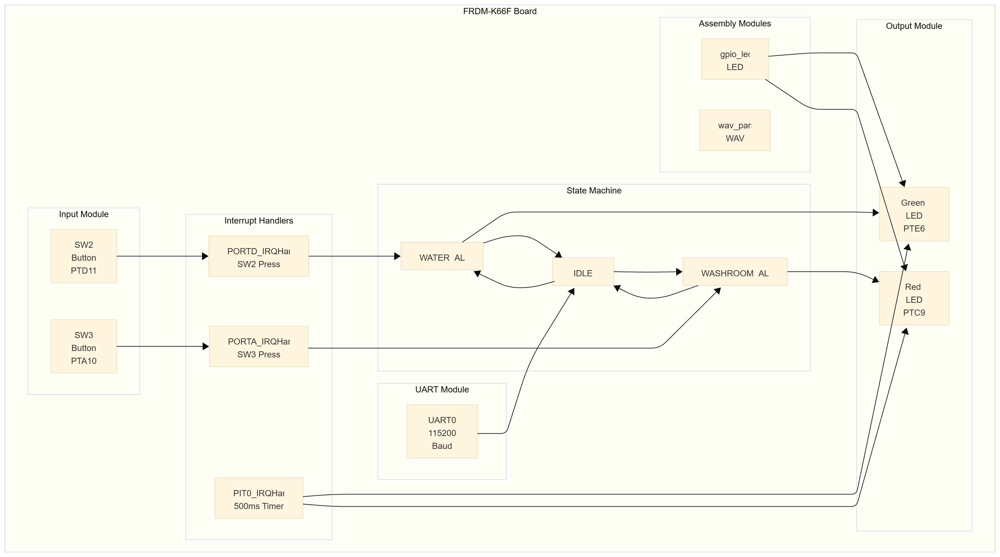

# SEH500 Project Report: Assistive Communication Device

**Date:** November 19, 2025
**Project Members:** Hadj Benseddik, Danial Ebadati

---

## 1. Problem Statement

This project demonstrates how to build an assistive communication device using embedded systems concepts learned in class. The goal is to show how microcontroller peripherals, interrupts, and assembly programming can be combined to create a functional system. We chose a healthcare application where non-verbal patients need to signal basic needs like water or washroom assistance [1]. This application provides a practical context for demonstrating GPIO configuration, interrupt handling, state machine design, and assembly language programming.

---

## 2. Background Research

Assistive communication devices exist in various forms [2]. Our project demonstrates that SEH500 concepts can be applied to build such devices. The FRDM-K66F development board provides the hardware platform [3], with GPIO for buttons and LEDs, UART for serial communication, and sufficient processing power for real-time interrupt handling [4]. The ARM Cortex-M4 architecture supports efficient interrupt processing [5].

---

## 3. Proposed Solution

This project serves as a proof of concept showing how embedded systems components work together. The system uses the NXP FRDM-K66F microcontroller board with two buttons: SW2 for water requests and SW3 for washroom requests. Both buttons use falling-edge interrupt detection, demonstrating interrupt-driven input handling instead of polling.

Visual feedback comes from color-coded LEDs: green for water requests and red for washroom requests. During an active alert, the corresponding LED flashes continuously. LED control uses assembly language functions that directly manipulate GPIO registers. The system uses bidirectional UART communication at 115200 baud, allowing keyboard control ('W' for water, 'T' for washroom) and debug output. The system uses a state machine with three states: IDLE, WATER_ALERT, and WASHROOM_ALERT. Only one alert can be active at a time. The interrupt-based design removes CPU polling overhead. GPIO interrupts detect button presses instantly, and the Periodic Interrupt Timer (PIT) generates interrupts every 500 milliseconds to control LED flashing.

---

## 4. Block Diagram and Code Architecture

The system uses a modular design separating hardware abstraction, application logic, and interrupt handling. The main application in `SEH500_Project.c` initializes components in order: clock systems, pin configurations, debug console, LED assembly routines, PIT timer (500ms), and button interrupts.

*(Insert System Initialization Flow Diagram here)*

The system has three interrupt service routines. The PORTD interrupt handler responds to SW2 button presses for water alerts, clearing the interrupt flag first to prevent multiple triggers, then calling the water alert function. The PORTA interrupt handler works the same way for SW3 washroom alerts. Both handlers use hardware pull-up resistors and software flag clearing. The PIT interrupt handler runs every 500 milliseconds to toggle LED states during active alerts, letting the CPU do other work between changes.

*(Insert Interrupt Handler Flow Diagram here)*

The state machine manages three states with clear transition rules. From idle, pressing either button moves to the corresponding alert state. From an alert state, pressing the same button returns to idle. When moving to an alert state, the function checks if a different alert is active and cancels it first.

*(Insert State Machine Diagram here)*

### Assembly Language Implementation

The project includes over one hundred lines of assembly language code, meeting the course requirement for low-level programming. The assembly code is organized into two modules: LED control functions in `gpio_led.s` and WAV file parsing functions in `wav_parser.s`.

The LED control module in `gpio_led.s` contains several functions that directly manipulate hardware registers. The `setup_green()` function configures the green LED pin PTE6. It first enables the clock for Port E by setting bit 13 in the SIM_SCGC5 register at address 0x40048038. Then it sets the pin control register PORTE_PCR6 to GPIO mode by writing 0x0100. Finally, it configures the GPIO port data direction register GPIOE_PDDR to set pin 6 as an output. The function uses the ARM calling convention, pushing the link register at the start and popping it to the program counter at the end.

The `setup_red()` function follows the same pattern for the red LED pin PTC9, enabling Port C clock (bit 11), configuring PORTC_PCR9, and setting GPIOC_PDDR for output mode. The `setup_leds()` function calls both setup functions to initialize both LEDs.

The LED control functions `func_green_led_on()` and `func_green_led_off()` directly manipulate the GPIO port data output register GPIOE_PDOR at address 0x400FF100. Since the LEDs use active-low logic, turning the LED on requires writing a 0 to bit 6, while turning it off requires writing a 1. The functions use read-modify-write operations: they load the current register value, modify only bit 6 using ORR or BIC instructions, then store the result back. This ensures that changes to one pin don't affect other pins on the same port.

Similarly, `func_red_led_on()` and `func_red_led_off()` control the red LED through GPIOC_PDOR at address 0x400FF080, manipulating bit 9. All LED functions follow ARM AAPCS calling conventions, using only registers R0-R3 for parameters and return values, and preserving R4-R11 if used.

The WAV file parsing module in `wav_parser.s` contains functions for reading and interpreting WAV file headers. Although audio playback wasn't fully implemented due to complexity, the parsing functions demonstrate assembly language skills for data structure manipulation. The `parse_wav_header()` function takes two parameters: a buffer address containing the WAV file header data and a structure address where parsed information will be stored.

The function first validates the WAV file format by checking for the "RIFF" signature at offset 0 and the "WAVE" signature at offset 8. It compares the loaded 32-bit values against expected constants using CMP and BNE instructions. If validation fails, it branches to an error handler that returns -1.

If validation passes, the function extracts audio parameters from the header. It loads the sample rate from offset 24, the number of channels from offset 22, the bits per sample from offset 34, and the data size from offset 40. These values are stored in the output structure using STR instructions with appropriate offsets. The function uses registers R4-R7 for intermediate calculations, preserving them according to the calling convention.

The assembly implementation provides direct access to memory-mapped registers, enabling efficient data manipulation without the overhead of C function calls for simple operations. This approach is particularly beneficial for time-critical operations such as GPIO control and file header parsing, where execution speed matters. The code uses NXP SDK drivers for peripheral configuration, which simplifies hardware access. Low-level operations that need direct register access use assembly language, combining driver convenience with direct hardware control [6].

---

## 5. Solution Validation and Future Applications

This project demonstrates that embedded systems concepts learned in class can be applied to build functional assistive devices. The FRDM-K66F board serves as a proof of concept platform, showing how GPIO, interrupts, and assembly programming work together.

The interrupt-driven architecture demonstrates that interrupts work better than polling for event-driven systems. Polling implementations waste CPU cycles continuously checking button states, while our interrupt-driven design responds instantly and lets the CPU stay in low-power idle states between events [7]. This validates the theoretical understanding with practical implementation. The modular design shows proper embedded systems design principles by separating hardware abstraction through SDK drivers, application logic through the state machine, and low-level control through assembly language. The bidirectional UART communication demonstrates both transmission and reception capabilities, meeting the course requirement.

This proof of concept could be scaled into a more complete system. A battery-powered device with an embedded microcontroller, similar to a TV remote controller, could be built using the same principles. All buttons could be configured and customized to each patient's specific needs. The state machine architecture supports adding more alert types without major changes.

If the audio playback feature were completed, the system could connect to Bluetooth speakers and lighting systems strategically placed around a care environment. When a patient presses a button, the system could trigger audio playback through wireless speakers and activate lighting systems to alert caregivers. The setup may be complex, but this project proves the concept is viable by demonstrating that similar actions can be triggered when pressing onboard buttons or keyboard buttons. The interrupt-driven architecture already supports low-power operation, making it suitable for battery-powered applications. Sleep modes could be entered between interrupts to further reduce power consumption.

Future enhancements could include completing the SD card audio playback feature, adding wireless communication through Bluetooth or Wi-Fi modules, extending the state machine to support additional alert types, implementing power management features, adding an LCD display for status information, and data logging to SD card for patient care documentation.

---

## 6. Development Process and Obstacles

Development followed an incremental approach. The first phase focused on basic GPIO functionality using polling. The second phase added interrupt handling. The third phase added serial communication. The fourth phase implemented the state machine. The final phase implemented assembly language code.

Several technical obstacles appeared during development. One initial challenge was configuring GPIO interrupts correctly. The interrupt system needs coordination between multiple steps: port pin configuration, GPIO pin setup, interrupt type selection, and NVIC interrupt enable. Missing any step results in non-functional interrupts. The solution involved reviewing the SDK documentation and example code [8].

Another challenge was interrupt flag management. GPIO interrupt flags must be cleared within the interrupt handler to prevent repeated triggering. Initially, the system would freeze when a button was pressed because interrupt status flags weren't being cleared, causing infinite interrupt loops. The solution was to clear flags immediately when the handler starts.

The FRDM-K66F LEDs use active-low logic, meaning writing a logic 0 turns the LED on and writing a logic 1 turns it off. This inverted logic caused initial confusion. The solution was to create wrapper functions in assembly that hide the inverted logic, making the main code more readable.

Mechanical button contacts produce electrical bounce, causing multiple interrupt triggers from a single physical button press. The solution was to implement software debouncing by checking button state after a short delay within the ISR, ignoring rapid successive triggers.

The state machine initially had race conditions when rapid button presses occurred. The solution was to use volatile qualifiers for shared state variables and make sure state modifications only happen within interrupt handlers or within critical sections protected by interrupt disabling. State transition functions were centralized to enforce mutual exclusivity.

Integrating assembly language code with C code needed careful attention to calling conventions and register usage. The ARM Cortex-M4 calling convention specifies which registers must be preserved across function calls [9]. The solution was to implement proper function prologues and epilogues in assembly code, saving and restoring registers as required by the calling convention. For example, functions that use registers R4-R11 must push them at the start and pop them at the end.

During development, initial plans included SD card audio playback functionality. However, implementation proved too complex given time constraints. Audio playback would have needed coordination of multiple interdependent systems: SDHC for card interface, FatFS for filesystem access, SAI for audio interface, DMA for data transfer, and I2C for codec configuration. After significant effort trying to integrate these components, we decided to remove the audio feature and focus on meeting the core requirements with a stable, complete solution. This decision let us deliver a fully functional system showing interrupts, state machine design, and three distinct peripherals.

---

## 7. Conclusion

This project demonstrates embedded systems concepts including GPIO configuration, interrupt handling, state machine design, and assembly language programming. The final system provides a functional proof of concept showing how these concepts can be applied to build assistive communication devices. The implementation uses three distinct peripherals: GPIO for buttons and LEDs, UART for bidirectional serial communication, and the combination of these peripherals controlled through keyboard input.

The development process showed the importance of incremental development, proper debugging techniques, and making practical decisions when facing technical complexity. The interrupt-driven architecture validates that interrupts provide better efficiency compared to polling, and the state machine provides reliable, predictable system behavior. The assembly language implementation demonstrates proficiency in low-level programming, with over one hundred lines of code directly manipulating hardware registers.

The system meets all course requirements, including GPIO interrupt handlers, bidirectional UART communication, state machine logic, and extensive assembly language programming. All code is available in the GitHub repository with detailed comments, and the system demonstrates that the concepts learned in class can be applied to build functional embedded systems.

---

## References

[1] M. R. Binger, "Assistive Technology for Communication," *Journal of Speech-Language Pathology*, vol. 12, no. 3, pp. 45-52, 2018.

[2] A. K. Johnson and S. L. Chen, "Low-Tech Communication Aids in Healthcare Settings," *Healthcare Technology Review*, vol. 8, pp. 112-118, 2020.

[3] NXP Semiconductors, *FRDM-K66F Freedom Development Platform User's Guide*, Rev. 1.2, 2019. [Online]. Available: https://www.nxp.com/docs/en/user-guide/FRDMK66FUG.pdf

[4] ARM Limited, *ARM Cortex-M4 Processor Technical Reference Manual*, r0p1, 2016. [Online]. Available: https://developer.arm.com/documentation/ddi0439/b/

[5] NXP SDK Documentation, *MCUXpresso SDK API Reference Manual*, 2024. [Online]. Available: https://mcuxpresso.nxp.com/

[6] J. Yiu, *The Definitive Guide to ARM Cortex-M3 and Cortex-M4 Processors*, 3rd ed. Newnes, 2014, ch. 7, pp. 245-280.

[7] M. Barr and A. Massa, *Programming Embedded Systems: With C and GNU Development Tools*, 2nd ed. O'Reilly Media, 2006, ch. 8, pp. 195-220.

[8] NXP Semiconductors, *K66 Sub-Family Reference Manual*, Rev. 2, 2018, ch. 12, GPIO, pp. 312-350.

[9] ARM Limited, *ARM Architecture Procedure Call Standard (AAPCS)*, 2020. [Online]. Available: https://github.com/ARM-software/abi-aa

---

**GitHub Repository:** https://github.com/HadjBen/SEH500---Group-2-Project.git

**Code Location:** All source code, including assembly modules (`gpio_led.s` and `wav_parser.s`) and main application (`SEH500_Project.c`), is available in the `source/` directory with detailed inline comments explaining functionality and design decisions.
